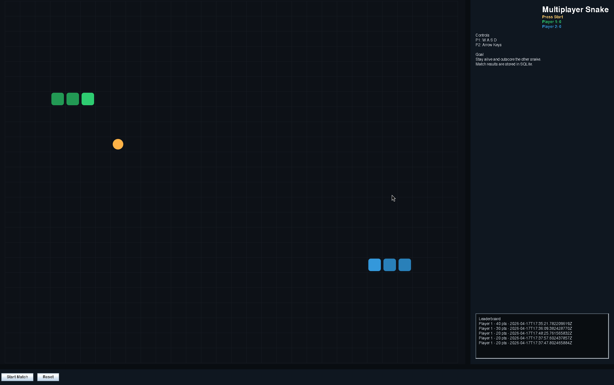

# Multiplayer Snake in Java

This project is a local multiplayer Snake game built with:

- Swing GUI
- multithreaded game loop and async SQLite persistence
- SQLite match history and leaderboard storage

## Controls

- Player 1: `W`, `A`, `S`, `D`
- Player 2: arrow keys

## Build

```bash
./build.sh
```

`javac` is required. The current workspace only has a JRE, so compilation here is blocked until a full JDK is installed.

## Run

```bash
./run.sh
```

## SQLite driver

The code uses JDBC with SQLite. To enable persistence at runtime, place the Xerial SQLite JDBC driver at:

```text
lib/sqlite-jdbc.jar
```

This workspace already has the driver downloaded in `lib/sqlite-jdbc.jar`.

## Screenshot

